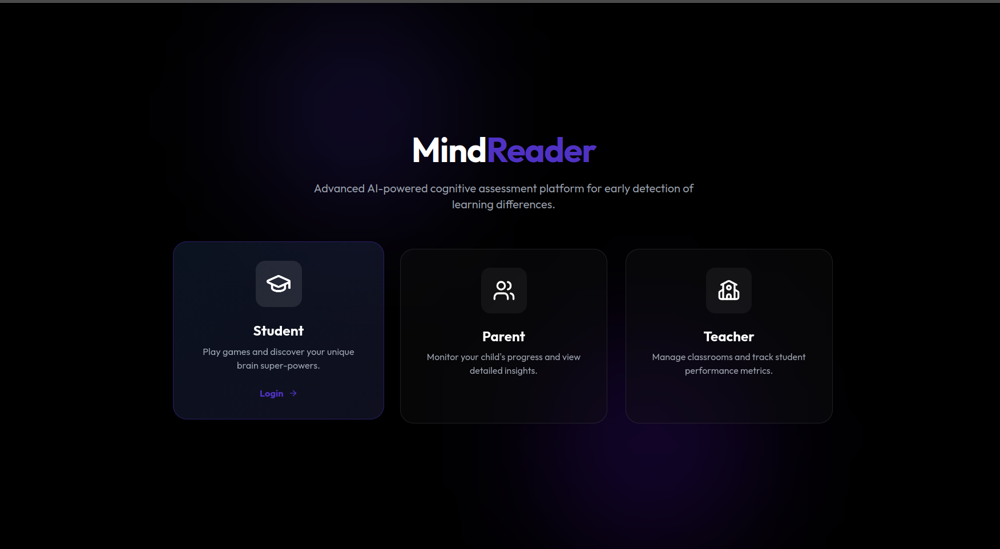
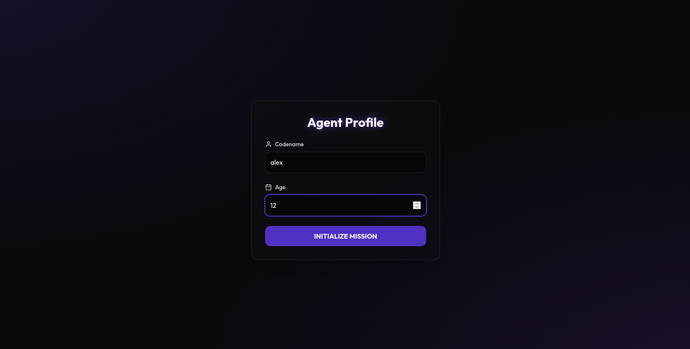
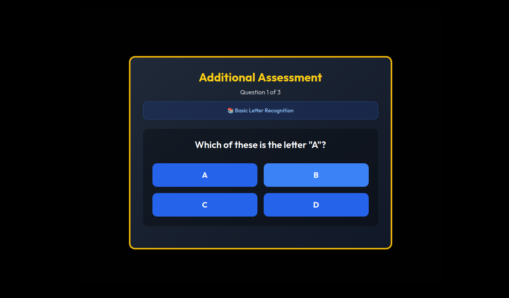
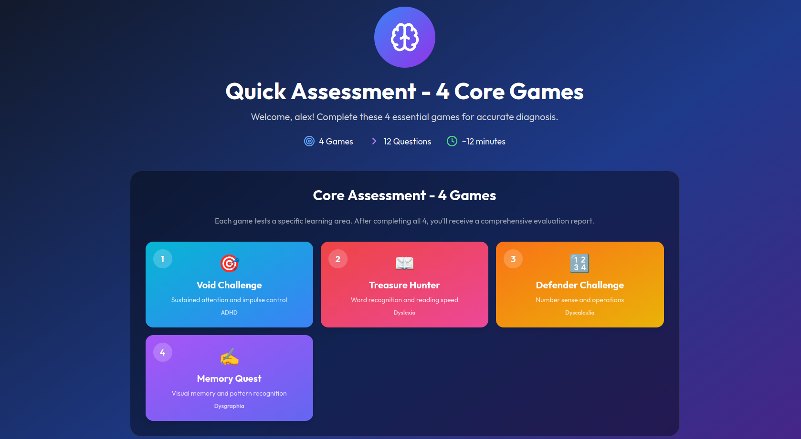
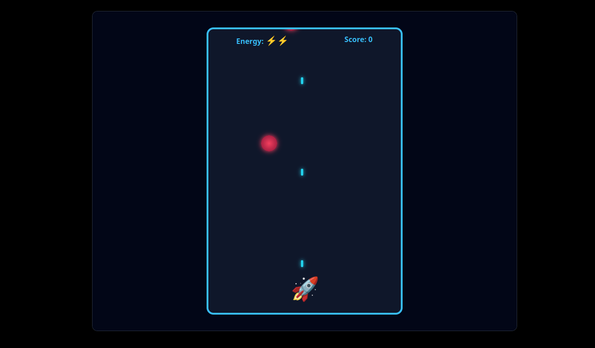
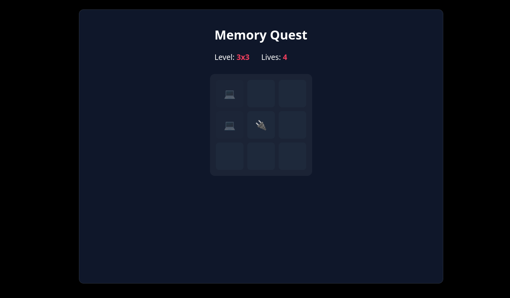
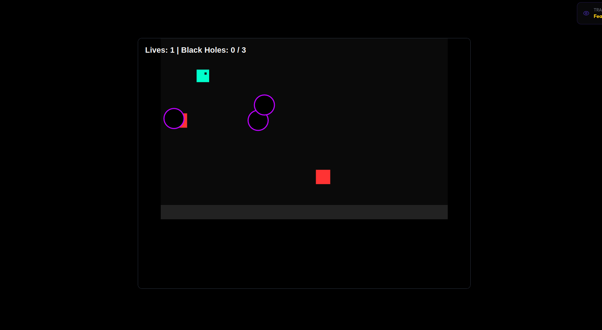
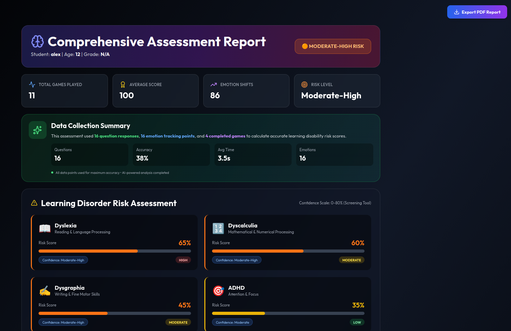

# MindReader - Cognitive Assessment Platform

A web-based cognitive assessment platform featuring interactive games and real-time emotion detection to evaluate mental health and cognitive abilities.



---

## 🚀 Quick Start

See [QUICK_START.md](./QUICK_START.md) for installation and setup instructions.

**TL;DR**: Run `npm install` then `npm run dev` and open `http://localhost:5173`

---

## 📁 Project Structure

```
mindreader/
├── src/
│   ├── components/     # Reusable UI components
│   ├── pages/          # Main application pages
│   ├── games/          # Interactive cognitive games
│   ├── services/       # AI and emotion detection services
│   ├── context/        # React context providers
│   └── utils/          # Helper functions
├── public/             # Static files and standalone HTML games
└── screenshots/        # Application screenshots
```

---

## 📱 Application Flow

### 1. Home Page
The landing page with an overview of the platform and getting started options.


---

### 2. Profile Setup
Create your profile by entering basic information before starting the assessment.



---

### 3. Questionnaire
Answer preliminary questions to help tailor the cognitive assessment.



---

### 4. Game Selection
Choose from various cognitive games designed to assess different mental abilities.



---

### 5. Interactive Games

#### Focus Flight
Test your focus and reaction time with this attention-based game.



---

#### Memory Quest
Assess your spatial memory and visualization capabilities.



---

#### Void Challenge
Test your problem-solving abilities in challenging scenarios.



---

### 6. Results & Dashboard
View comprehensive results, scores, and cognitive assessment reports.



---

## 🛠️ Tech Stack

- **Frontend**: React + Vite
- **Styling**: Tailwind CSS
- **AI/ML**: OpenAI API, Custom Emotion Detection
- **Charts**: Recharts

---

## 🎮 Available Games

1. **Focus Flight** - Attention and focus assessment
2. **Memory Quest** - Spatial memory and recall
3. **Void Challenge** - Problem-solving and logic
4. **Matrix Reasoning** - Pattern recognition
5. **Number Ninja** - Numerical reasoning
6. **Lexical Legends** - Language skills

---

## 📚 Documentation

- [Quick Start Guide](./QUICK_START.md) - Installation and setup
- [Architecture](./ARCHITECTURE.md) - Technical architecture
- [Privacy Policy](./README_PRIVACY.md) - Data handling and privacy
- [Games Integration](./GAMES_INTEGRATION.md) - Game development guide

---

**IHRD Hackathon Project**
